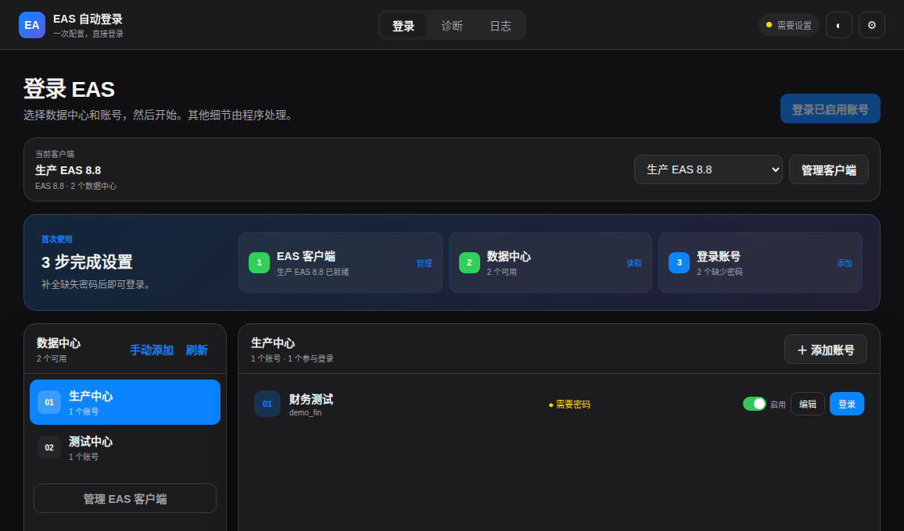

# EAS 自动登录中心

当前源码版本为 **0.27.0**。这一版把 EAS 客户端升级为一等模型：同一台电脑可保存多个 EAS 版本/安装目录，备注可编辑，客户端各自拥有数据中心，账号显式绑定客户端；0.26.x 的单客户端配置会自动迁移并保留迁移前备份。



## 目录结构

| 目录 | 内容 |
|---|---|
| `src` | Electron 主进程、界面、自动化与核心逻辑 |
| `src/platform` | Windows / Linux / macOS 平台策略适配层，业务代码不直接判断操作系统 |
| `tests` | Node.js 自动化测试 |
| `scripts` | Web 版构建脚本 |
| `build` | 图标、Java 辅助工具和构建资源 |
| `skill/eascloud-ubuntu-rpa` | EAS Cloud Ubuntu RPA Skill |
| `docs/screenshots` | 当前界面截图 |
| `docs/PROJECT_MIGRATION.md` | 从原 `kingdee-eas` 工作区迁移到独立仓库的版本整理说明 |
| `dist` | 构建产物；仅分发已验证的对应平台版本 |

## 最新发布包

Ubuntu 版本已在本机完成构建：

- Ubuntu 免安装：`dist/EAS-RPA-Console-0.27.0-x86_64.AppImage`
- Ubuntu/Debian 安装包：`dist/EAS-RPA-Console-0.27.0-amd64.deb`

Windows 与 macOS 包必须分别在 Windows、macOS 上构建。不要分发在 Ubuntu 上交叉构建的包：`keytar` 是原生凭据模块。0.27.0 的多客户端模型在 Windows/Linux 共用；Windows 仍使用 DPAPI、`client.bat`、PowerShell/CIM 和 Java Swing Agent，Linux 使用 Secret Service、`client.sh`、`/proc`、X11/AT-SPI。macOS 保留 POSIX/Keychain 适配入口，在完成 EAS 实机验收前仍视为实验支持。

AppImage 可直接双击运行。如当前系统未启用 FUSE，建议安装 `.deb` 包。

## 开发与构建

```bash
npm ci
npm start
```

```bash
npm run build:linux
npm run build:windows
npm run build:mac
npm run build:web
```

请在目标操作系统分别执行对应命令；构建脚本会拒绝在错误系统上交叉打包。分别使用 x64 Windows、x64/Apple Silicon macOS 主机，并检查包内 `keytar.node` 的平台格式，再在该系统实机安装验证。分发 macOS 版本前还需要 Apple Developer ID 签名与公证。

构建过程会重新生成展开目录和中间文件；请勿将 `dist/unverified-cross-builds` 中的旧交叉构建文件发给别人。

## 跨平台代码结构

- `src/platform/index.js` 是唯一直接读取 `process.platform` 的位置，并根据系统加载 `windows.js`、`linux.js`、`macos.js` 或 `generic.js`。
- `src/platform/*` 独占凭据、进程树、停止进程、会话探测、命令探测和启动脚本包装等 OS 实现。
- `src/core/*` 负责配置、账号、运行状态机、数据中心探测和登录逻辑，只消费平台适配器接口，不直接调用 PowerShell、`taskkill`、Secret Service、`/proc` 或 `loginctl`。
- Windows：`client.bat` + `cmd.exe`、DPAPI、PowerShell/CIM 进程树、Java Swing Agent。
- Linux：`client.sh` / `.desktop`、Keyring/Secret Service、`/proc` 进程树、X11/AT-SPI + Java Swing Agent。
- macOS：POSIX 启动、Keychain/keytar、`ps` 进程树适配入口；EAS 自动登录仍需实机验收。

## 当前能力

- 运行中心与串行登录任务。
- 保存多个 EAS 客户端安装目录/版本，并使用可编辑备注快速切换。
- 每个客户端独立维护数据中心；账号显式绑定客户端，避免多版本串线。
- EAS 版本仅在有可靠证据时展示；无法确认时使用兼容模式，不阻断运行。
- 从 0.26.x 单客户端结构自动迁移，并保留 `config.yaml.pre-multi-client.bak`。
- 账号启用、停用与添加。
- Linux X11/Wayland 与 Windows 会话、窗口工具、AT-SPI、Secret Service/DPAPI 和启动器的真实探测。
- Linux `.desktop` 与 Windows `client.bat` 启动路径解析及自动化能力矩阵。
- 启动器、超时和失败策略的 YAML 持久化。
- Linux 使用 Keyring/Secret Service，Windows 使用当前用户 DPAPI 加密凭据；配置和日志不保存明文密码。
- 以参数数组启动客户端，不经过 shell 或桌面图标双击。
- 按 run ID、账号 ID 和 PID 记录任务创建的进程。
- 使用 PID、窗口标题和 AT-SPI 识别登录窗口。
- 安全停止仅作用于当前任务明确持有的进程。
- 实时活动、脱敏日志与明暗主题。

## 安全说明

Linux 密码通过系统 Keyring/Secret Service 读取；Windows 密码使用当前用户作用域的 DPAPI 加密存储。配置、日志及界面中不保存明文密码。

运行时配置与日志通常位于 `~/.config/eascloud-rpa-console/`。仓库中的 `config.example.yaml` 仅含虚构示例。

## 历史版本

已从旧发布包与 Windows 测试快照中恢复历史版本。Git 中保留 `v0.13.0` 至 `v0.23.0` 的可证明历史版本，其中 `v0.21.2-windows-test` 为独立 Windows 实机测试快照；`v0.24.x` 建立跨平台适配层，`v0.25.0` 完成平台实现隔离，`v0.26.0` 完成两轮独立验收，`v0.26.1` 修复响应式布局，`v0.27.0` 引入多 EAS 客户端一等模型、备注管理与旧配置自动迁移。

恢复版本的证据、分支设计和本地发布包归档位置见 [`docs/RECOVERED_HISTORY.md`](docs/RECOVERED_HISTORY.md)。

用户提供的 Windows 0.21.2 正式安装包静态解包与源码一致性校验见 [`docs/WINDOWS_0.21.2_INSTALLER_ANALYSIS.md`](docs/WINDOWS_0.21.2_INSTALLER_ANALYSIS.md)。

```bash
git tag --list --sort=version:refname
git log --oneline --decorate history/recovered-release-snapshots
```

## 测试

```bash
npm test
npm run check
npm run acceptance
```


## 0.26.0 独立验收

- 工程纪律：[`docs/ACCEPTANCE_BROOKS.md`](docs/ACCEPTANCE_BROOKS.md)
- 产品体验：[`docs/ACCEPTANCE_PRODUCT.md`](docs/ACCEPTANCE_PRODUCT.md)
- 最终勾选清单：[`docs/ACCEPTANCE_CHECKLIST.md`](docs/ACCEPTANCE_CHECKLIST.md)
- 0.26.1 窗口响应式验收：[`docs/RESPONSIVE_ACCEPTANCE_0.26.1.md`](docs/RESPONSIVE_ACCEPTANCE_0.26.1.md)

## 0.27.0 多客户端验收

- 多客户端数据模型：[`docs/MULTI_CLIENT_MODEL.md`](docs/MULTI_CLIENT_MODEL.md)
- Brooks 工程轮：[`docs/ACCEPTANCE_BROOKS_0.27.0.md`](docs/ACCEPTANCE_BROOKS_0.27.0.md)
- Jobs 产品轮：[`docs/ACCEPTANCE_PRODUCT_0.27.0.md`](docs/ACCEPTANCE_PRODUCT_0.27.0.md)
- 发布勾选清单：[`docs/ACCEPTANCE_CHECKLIST_0.27.0.md`](docs/ACCEPTANCE_CHECKLIST_0.27.0.md)
